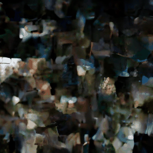
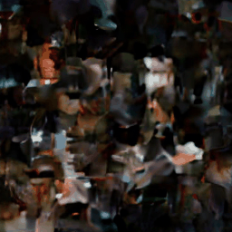

# Equilibrium Matching

> **Fork Notice:** This is [@nomadicsynth](https://github.com/nomadicsynth)'s fork adding **video generation** capabilities. This is a **work in progress**, but early results indicate the approach is promising.

---

### [Paper](https://arxiv.org/abs/2510.02300) | [Project Page](https://raywang4.github.io/equilibrium_matching/)


This repo contains the official PyTorch implementation of Equilibrium Matching.

> [**Equilibrium Matching: Generative Modeling with Implicit Energy-Based Models**](https://arxiv.org/abs/2510.02300)<br>
> [Runqian Wang](https://raywang4.github.io/), [Yilun Du](https://yilundu.github.io/)
> <br>MIT, Harvard<br>

We introduce Equilibrium Matching (EqM), a generative modeling framework built from an equilibrium dynamics perspective. EqM discards the non-equilibrium, time-conditional dynamics in traditional diffusion and flow-based generative models and instead learns the equilibrium gradient of an implicit energy landscape. Through this approach, we can adopt an optimization-based sampling process at inference time, where samples are obtained by gradient descent on the learned landscape with adjustable step sizes, adaptive optimizers, and adaptive compute. EqM surpasses the generation performance of diffusion/flow models empirically, achieving a FID of 1.90 on ImageNet 256x256. EqM is also theoretically justified to learn and sample from the data manifold. Beyond generation, EqM is a flexible framework that naturally handles tasks including partially noised input denoising, OOD detection, and image composition. By replacing time-conditional velocities with a unified equilibrium landscape, EqM offers a tighter bridge between flow and energy-based models and a simple route to optimization-driven inference.

We implement Equilibrium Matching on top of the [Dispersive Loss](https://github.com/raywang4/DispLoss) codebase.

---

## Video Generation (WIP)

This fork extends EqM to video generation. Early results on UCF-101 with 4-frame samples show the model is learning temporal dynamics. Below are sample generations from an EqM-S/4 model after 11,840 training steps:

<p align="center">




</p>

**Note:** These are very early results (4 frames each, low quality) but demonstrate that the approach is possibly viable for temporal modeling. Training is ongoing and better results will be added in the future.

---

## Setup

Run the following script to setup environment.

```bash
git clone https://github.com/raywang4/EqM.git
cd EqM
conda env create -f environment.yml
conda activate EqM
```

## Training

To train an Equilibrium Matching (EqM) model, use the following training script:

```bash
torchrun --nnodes=1 --nproc_per_node=N train.py --model EqM-XL/2 --data-path /path/to/imagenet/train
```

To train an Equilibrium Matching model with explicit energy (EqM-E) with dot product parameterization, use the following script:

```bash
torchrun --nnodes=1 --nproc_per_node=N train.py --model EqM-XL/2 --data-path /path/to/imagenet/train --ebm dot
```

**Logging.** To enable `wandb`, firstly set `WANDB_KEY`, `ENTITY`, and `PROJECT` as environment variables:

```bash
export WANDB_KEY="key"
export ENTITY="entity name"
export PROJECT="project name"
```

Then in training command add the `--wandb` flag:

```bash
torchrun --nnodes=1 --nproc_per_node=N train.py --model EqM-XL/2 --data-path /path/to/imagenet/train --disp --wandb
```

**Resume training.** To resume training from custom checkpoint:

```bash
torchrun --nnodes=1 --nproc_per_node=N train.py --model EqM-XL/2 --data-path /path/to/imagenet/train --ckpt /path/to/model.pt
```

## Sampling

**Pre-trained checkpoints.** We provide a [EqM-B/2 checkpoint](https://drive.google.com/file/d/1kDZGOri7Hf4CgnJAdEDguWooY3al37T6/view?usp=sharing) trained for 80 epochs and a [EqM-XL/2 checkpoint](https://drive.google.com/file/d/1AfMLAxz18hthaGmYvQjB6c1LMxSEGly6/view?usp=sharing) trained for 1400 epochs on ImageNet 256x256.

**Sampling from checkpoint.** To sample from the EMA weights of a 256x256 EqM-XL/2 model checkpoint with NAG-GD sampler, run:

```bash
python sample_gd.py --model EqM-XL/2 --ckpt /path/to/model.pt
```

**More sampling options.** For more sampling options such as vanilla gradient descent sampling, please refer to [`sample_gd.py`](sample_gd.py). For integration-based sampling, please use [`sample_ddp.py`](sample_ddp.py).

## Evaluation

The [`sample_gd.py`](sample_gd.py) script samples a large number of images from a pre-trained model in parallel. This script
generates a folder of samples as well as a `.npz` file which can be directly used with [ADM's TensorFlow
evaluation suite](https://github.com/openai/guided-diffusion/tree/main/evaluations) to compute FID, Inception Score and
other metrics. To sample 50K images from a pre-trained EqM-XL/2 model over `N` GPUs under default NAG-GD sampler settings, run:

```bash
torchrun --nnodes=1 --nproc_per_node=N sample_gd.py --model EqM-XL/2 --num-fid-samples 50000 --ckpt /path/to/model.pt
```

We report our evaluation results below.

| model | epochs | sampler config | cfg | FID |
|-|:-:|:-:|:-:|:-:|
| EqM-B/2 | 80 | GD sampler, $\eta=0.003$ | 1.0 | 32.85  |
| EqM-XL/2 | 1400 | NAG-GD sampler, $\eta=0.0017$, $\mu=0.3$ | 1.5 | 1.90  |
