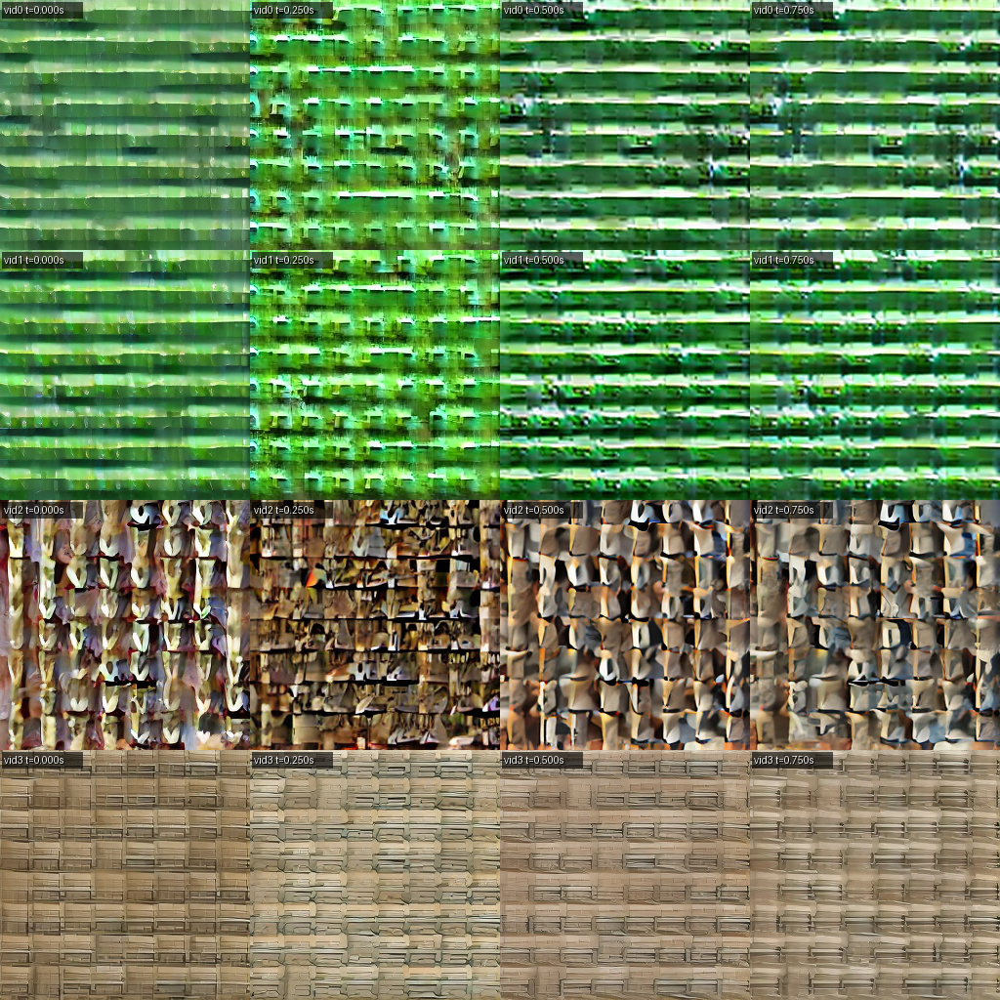

# Things to Check

- [ ] cfg free guidance. it was messed-with during debugging. make sure it works like the reference implementation from upstream
- [ ] check if gradient clipping is working. gradients are huge, even with it turned on.
- [ ] the samples from the currently training checkpoint look like they're made up of tiny images tiled together. is this an attention bug, or just a symptom of insufficient training?
    
